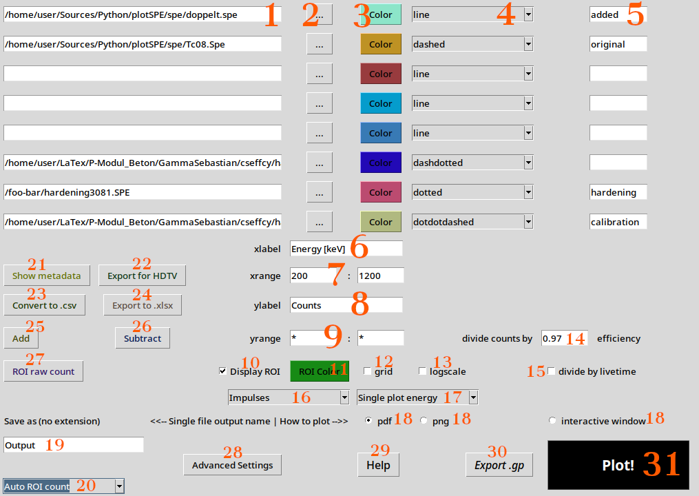
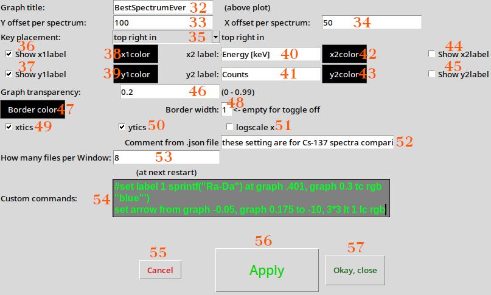

# .spe-plot-and-more
## plotSPE

# General Overview
Processing and plotting of .Spe spectrum files from Maestro/GammaVision, making use of python and gnuplot

partly AI generated, inconsistent messy spaghetti code without magic numbers - main goal fullfilled: _it works_!
This program is best used as standalone **executable** for comfortable plotting and processing ASCII spectra in `.spe` format. But it also runs flawlessly as a Python3 script.
The executable already includes **Python (with all required modules)** as well as **gnuplot**, which explains the comparatively large file size. No additional software installation is required.

---
# GUI Interface

[Main window of the application](images/main-nr.png)

[Advanced Settings Window](images/settings-nr.png)

---

# Making Your Own Windows Executable
**Copy the folder _WindowsExecutable_ to your harddisk**
- Install _pyinstaller_
- Replace .ico file for a real one
- Add plotSPE.py to the folder
- Run the .bat file in the folder
The additional Python script is necessary to make changes to the source code, so that the obtained executable is no longer attached to a (visible) terminal. For a Linux executable this is obsolete.

# Program Startup and Configuration Files

When the program is started for the first time, it loads **default settings**.  
Upon normal termination (e.g. via the window close button), all current settings are saved to a `.json` configuration file located in the same directory as the executable.

**Important notes:**
- Settings are saved **only** when the program is closed normally.
- Settings are **not** saved if the program is terminated forcibly (e.g. via Task Manager).

If persistent errors or misconfigurations occur, the configuration file can simply be deleted.  
The program will then restart with default settings.

---

# Spectrum File Input

The text fields in the upper-left area are used to enter file names or paths to `.spe` spectra **(1)**.  
Alternatively, the button with three dots **(2)** opens a file selection dialog.

For each spectrum:
- **Color** button **(3)** assigns the curve color.
- Adjacent drop-down menu **(4)** selects the line style (solid, dashed, dotted, etc.).
- Text fields on the right **(5)** define the legend label for the curve.

---

# Starting the Program with Arguments

The program can be started with `.spe` file names as command-line arguments.  
On Windows, this can be done by dragging one or more `.spe` files onto the executable.

- The number of spectrum input fields is adjusted automatically.
- Manual adjustment is possible via **Advanced Settings** → *How many files per window* **(53)**.

---

# Output File Naming

The text field in the lower-left corner **(19)** defines the base name for all output files.  
If a file with the chosen name already exists, an `x` is appended automatically to prevent overwriting.

---

# Plot Axes and Display Options

- **xlabel** **(6)** and **ylabel** **(8)** define axis labels.
- **xrange** **(7)** and **yrange** **(9)** define axis ranges.
- **Display ROI** **(10)** highlights ROIs defined in Maestro using a selectable color **(11)**.
- **grid** **(12)** enables grid lines.
- **logscale** **(13)** enables logarithmic y-axis scaling.

---

# Normalization and Corrections

- **divide by livetime** **(15)** displays count rate instead of raw counts.
- **divide counts by efficiency** **(14)** applies a user-defined efficiency factor.

> **Note:** Detector efficiency is energy-dependent. A single efficiency value is therefore only an approximation.

---

# Plot Modes

Left drop-down menu **(16)** selects the plot style:
- Impulses (Maestro-like)
- Steps
- Continuous lines
- Additional styles

Right drop-down menu **(17)** controls:
- Energy-calibrated vs. raw channel plotting
- Single-spectrum vs. multi-spectrum plots

---

# Plot Output Target

Radio buttons **(18)** select the plot destination:
- PDF file
- PNG file
- Interactive gnuplot window

---

# Additional Buttons

- **Advanced Settings** **(28)** – opens extended configuration options.
- **Help** **(29)** – opens multilingual help, license text, and Easter eggs.
- **Export .gp** **(30)** – exports the gnuplot script and data files.
- **Plot!** **(31)** – executes the plot.

---

# Batch Actions for All Spectra

Buttons below the spectrum list apply actions to all spectra:

- **Show metadata** **(21)** – displays file and spectrum metadata.
- **Export for HDTV** **(22)** – converts spectra for HDTV (calibration reliability limited).
- **Convert to .csv** **(23)** – exports calibrated CSV files.
- **Export to .xlsx** **(24)** – exports Excel-compatible files.
- **Add** **(25)** – adds all spectra (including livetime and ROIs).
- **Subtract** **(26)** – subtracts all spectra from the top spectrum.
- **ROI raw count** **(27)** – sums counts inside Maestro-defined ROIs.

---

# Automation Mode

All actions can be automated:

1. Select an action from the automation menu **(20)**.
2. Configure all required settings.
3. Close the program to save the configuration.
4. Restart the program with `.spe` files as arguments.

The program executes the action automatically and exits  
(except for interactive plots).

Automation mode is disabled when starting the program without arguments.

---

# Error Handling and Flexibility

The program does not usually display explicit error messages.

Instead:
- Invalid or critical settings are highlighted in **red**.
- The program still attempts to execute the requested action.

This allows intentional misconfiguration for advanced or experimental use cases.

---

# Multiple Spectra in One Graph

Multiple spectra can be plotted in a single graph for comparison.  
If curves overlap, **x-offsets** **(34)** or **y-offsets** **(33)** can be defined in **Advanced Settings** to improve readability.

---

# Advanced Settings

- **Graph Title** **(32)** sets the plot title.
- **Y offset per spectrum** **(33)** and **X offset per spectrum** **(34)** shift subsequent curves.
- **Key placement** **(35)** controls legend positioning.
- **Show x1label** **(36)** / **Show y1label** **(37)** toggle primary axis labels.
- Axis colors via **x1color** **(38)** and **y1color** **(39)**.
- Secondary axes via **x2 label** **(40)** / **y2 label** **(41)** with colors **(42, 43)** and visibility **(44, 45)**.
- **Graph transparency** **(46)** sets curve opacity.
- **Border color** **(47)** and **Border width** **(48)** control frame appearance.
- **xtics** **(49)** / **ytics** **(50)** toggle axis ticks.
- **logscale x** **(51)** enables logarithmic x-axis.
- **Comment field** **(52)** stores descriptive notes.
- **How many files per window** **(53)** sets spectrum count per window.
- **Custom commands** **(54)** allows advanced gnuplot commands.

---

## Dialog Buttons

- **Cancel** **(55)** – discard changes.
- **Apply** **(56)** – save changes.
- **Okay, close** **(57)** – save changes and close the window.
